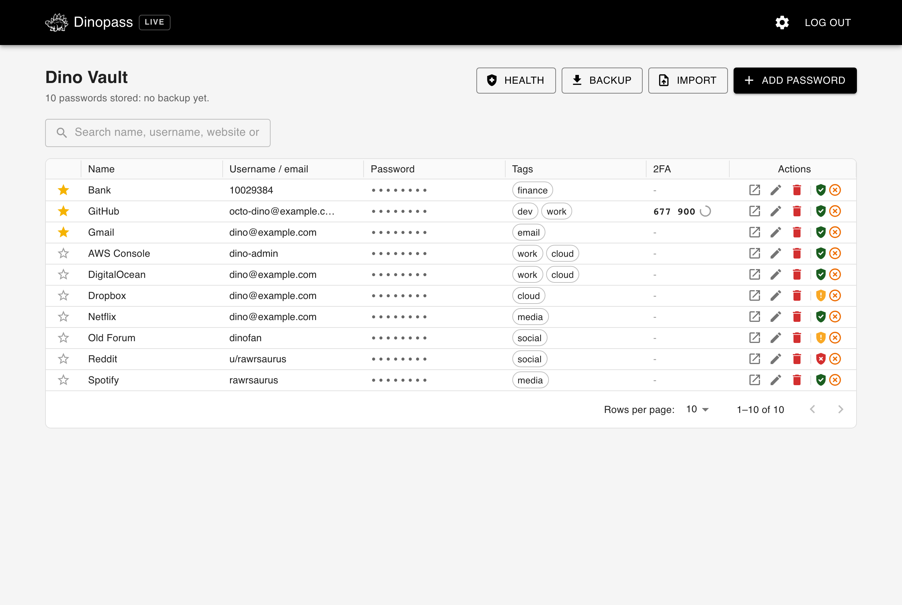
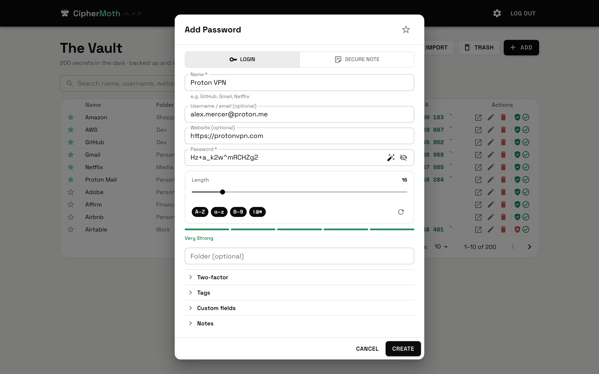
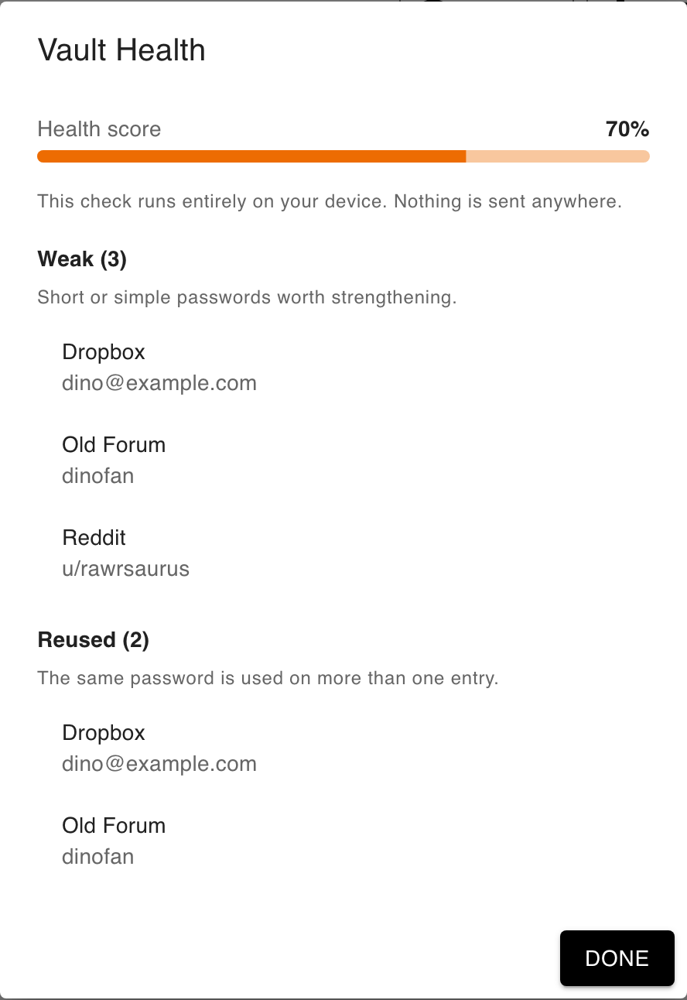
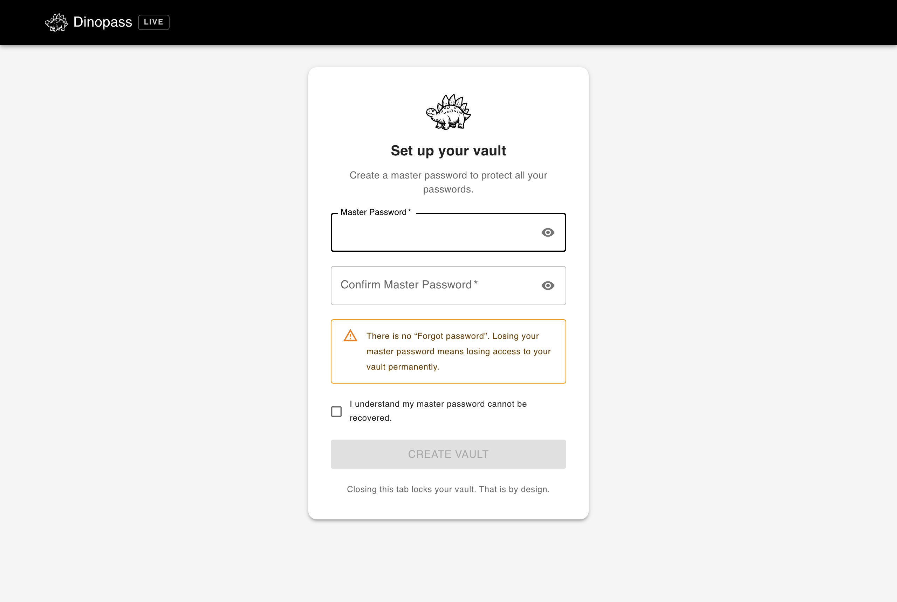

<div align="center">

# CipherMoth

**Your secrets stay in the dark.**

A simple, self-hosted password manager with **no accounts, no cloud, and no witnesses.**

[](https://github.com/mr-grj/ciphermoth/actions/workflows/ci.yml)
[](https://github.com/mr-grj/ciphermoth/releases/latest)
[](./LICENSE)
[](https://www.python.org/)
[](https://www.postgresql.org/)
[](#get-started)

</div>

```
      \_       _/
        \\   //
      .--\\_//--.
     /    (o)    \      -- Nobody's watching. That's the whole point.
    |   .-' '-.   |
     \  '-._.-'  /
      '--.___.--'
          |||
```

---

## What is this?

I built this for myself because I was tired of every password manager wanting my email address, a subscription, a browser extension with access to everything, and ideally my soul too. Most of the big ones lean on a hosted account, a sync layer, or a monthly bill by default. Some are open source or can be self-hosted, which is genuinely great, but the easy path still points at a cloud you don't run.

I wanted something that lives on my own machine, has no telemetry, talks to no third party, and doesn't wake up one day to announce it's been acquired and my vault is migrating to some new platform. No Google. No OAuth. No "sign in with Apple". No analytics pinging home. Nothing.

So there's **CipherMoth**. It lives on your hardware, speaks to nobody, and keeps your passwords encrypted with a key only you know. One master password unlocks everything. If someone gets the database, they get encrypted blobs, not your passwords.

**Paranoia, but productive.**

It's probably overkill for most people. But it's yours, and that's the point.

## Get started

CipherMoth runs on your own machine with [Docker](https://docs.docker.com/get-docker/). One command sets a strong database password for you, pulls the **signed** images, and starts everything:

```shell
curl -fsSL https://raw.githubusercontent.com/mr-grj/ciphermoth/master/install.sh | sh
```

Then open **[http://localhost:3000](http://localhost:3000)**, create your master password, and you're in. It also offers to turn on [one-click updates](#staying-up-to-date).

Rather see what runs before running it? Read the script first (`curl -O …/install.sh` then open it), or set it up by hand with two files:

```shell
curl -O https://raw.githubusercontent.com/mr-grj/ciphermoth/master/docker-compose.prod.yml
curl -O https://raw.githubusercontent.com/mr-grj/ciphermoth/master/.env.prod.example
cp .env.prod.example .env          # then set POSTGRES_PASSWORD
docker compose -f docker-compose.prod.yml up -d
```

Your vault lives in a persistent Docker volume, so it survives restarts and updates. On a server rather than `localhost`? See [Putting it on a real server](#putting-it-on-a-real-server).

> ⚠️ **There is no password recovery.** Losing your master password means losing your vault, permanently. No reset link, no support email, no backdoor. That's the trade for nobody-but-you holding the key. **Write it down somewhere safe**, and take a backup once you've added a few entries.

## Screenshots

|  |  |
|---|---|
| **The vault** | **Add a password, generate a strong one** |
|  |  |
| **Vault health, computed on your device** | **First run: set up your master password** |
|  |  |

Minimal black-and-glow UI, a clean moth, and a live 2FA column that rolls in your browser. That's the whole vibe.

## What it does

The basics you'd expect:

- One master password unlocks the vault, no account, no email, no recovery codes sent to a phone number you changed three years ago
- All passwords encrypted at rest; the encryption key is derived from your master password and never touches the server
- Web UI for day-to-day use: create, edit, delete, search by name, username, website, or tag
- Store the website, a username, tags, and a two-factor (TOTP) secret alongside each password
- Built-in two-factor codes: paste a 2FA secret and CipherMoth shows the live rolling code, computed in your browser
- Favorites and tags to keep a growing vault tidy, plus password history so a changed password is never truly gone
- Trash for deletions: entries you remove go to a Trash you can restore from, or empty for good when you're sure
- Vault health check that flags weak, reused, and old passwords, runs entirely on your device, nothing is sent anywhere
- Password generator with configurable length and character sets, cryptographically secure, not the `Math.random()` kind
- Strength indicator on every password so you can see at a glance which ones are embarrassing
- CLI (`ciphermoth`) for when you'd rather not open a browser
- Import from Chrome, Bitwarden, KeePass, Proton Pass and friends with a plain CSV, or restore an encrypted CipherMoth backup
- Encrypted backup export and import so you're not one disk failure away from losing everything
- Auto-locks after inactivity and clears the clipboard after copy, small things that matter

## Who it's for (and who it isn't)

CipherMoth is probably a good fit if you:

- want a self-hosted password manager with no accounts, no telemetry, and no third parties
- are comfortable running Docker on a machine you control
- like small, auditable software and are happy owning your own backups

It's probably not for you (yet) if you need:

- browser autofill or a mobile app
- family or team sharing
- managed cloud sync across all your devices
- a way to recover your vault if you forget your master password

No hard feelings, those are real needs, just not what this is trying to be.

## Security status

Straight up, because this is a password manager and you deserve it: **CipherMoth has not been independently audited.** It's a personal project I use myself and built carefully, with the crypto kept small and readable on purpose, but it has not been through a formal third-party security review. It's designed for self-hosted personal use on hardware you trust, not as a public, multi-tenant service holding other people's secrets. If you're storing high-value secrets, weigh that accordingly.

How to report something is in [SECURITY.md](./SECURITY.md).

## How the security actually works

- Your master password is hashed with **bcrypt**, never stored in plain, nothing reversible. New vaults require a reasonably strong master password (at least 12 characters, mixed types), enforced on the server, not just in the browser
- Every stored password is encrypted with **Fernet** (AES-128-CBC + HMAC-SHA256) using a key derived from your master password via **Argon2id** (64 MiB memory, 3 iterations, 4 lanes, the OWASP 2024 interactive profile). The key is unique per vault thanks to a random salt
- The website, two-factor secret, tags, and password history are encrypted the same way. The database never learns which sites you have accounts on or how you organise them
- That derived key lives only in your browser's `sessionStorage` for the duration of your session, it never touches the server, and it disappears the moment you close the tab
- If you change your master password, every encrypted field is re-encrypted transparently
- The password generator uses `crypto.getRandomValues` with rejection sampling to eliminate modulo bias, no `Math.random()`, no shortcuts

If someone steals the database, they get a pile of ciphertext and a bcrypt hash. Without your master password, and assuming you chose a strong one, there's nothing in there they can read.

## Threat model

No security tool defends against everything, and a password manager that pretends otherwise is lying to you. Here's the honest shape of it.

**CipherMoth is built to protect against:**

- Someone who steals the database or the disk, they get ciphertext and a bcrypt hash, not your passwords
- Accidental server-side exposure, the server never persists your master password or the derived key
- Casual inspection of stored data, even the metadata (websites, tags, 2FA secrets, history) is encrypted

**CipherMoth does not protect against:**

- Malware, a keylogger, or a compromised browser on the device you use to unlock the vault
- A malicious script running in your session reading the key while the tab is open, the usual trade-off for any web vault, and why the dependency list is kept small
- A weak master password, if it's guessable, everything above unwinds
- Exposing the instance directly on the public internet without HTTPS and a reverse proxy
- Forgetting your master password, there is no recovery, full stop (see below)

The takeaway: run it on a machine and network you trust, use a strong master password, and keep a backup.

## Tech stack

| Layer | Tech |
|---|---|
| Backend | Python 3.13, FastAPI, SQLAlchemy 2.0, asyncpg |
| Database | PostgreSQL 16 |
| Frontend | React 19, Vite, MUI v9, easy-peasy |
| Package manager | uv (backend), npm (frontend) |
| Infrastructure | Docker, Docker Compose v2 |

## Development

Want to work on CipherMoth itself? Clone the repo, then start the dev stack. It builds from your working tree and hot-reloads, and it's a throwaway sandbox with its own database, completely separate from any real vault.

```shell
make setup   # creates backend/.db.env with a generated database password
make dev     # build + start with hot-reload
```

**Open [http://localhost:3000](http://localhost:3000)** (UI) and `http://localhost:8000` (API); the API explorer is at `/docs` on the API port. The backend restarts on any `.py` change and the React dev server picks up frontend changes instantly.

### Dev sandbox vs the real vault

| | Development (local) | Real vault |
|---|---|---|
| Start it with | `make dev` | `docker compose -f docker-compose.prod.yml up -d` (or `make prod-up`) |
| Source | built from your working tree, hot-reload | prebuilt GHCR images |
| Compose project | `ciphermoth-dev` | `ciphermoth` |
| Database volume | `ciphermoth-dev_postgres_data` (disposable) | `ciphermoth_postgres_data` (persistent) |
| UI / API | `:3000` / `:8000` | `:3000` / `:8000` (configurable) |
| Badge in app bar | amber **DEV** | calm **LIVE** |

They are separate Compose projects with separate volumes, so the dev sandbox can never see or clobber your real vault. The environment badge is derived from the build itself (Vite dev server vs `vite build`), so there's nothing to configure. If you ever see amber, you're in the sandbox, don't type anything real.

> Both default to port `3000`. That's fine because dev is local and the real vault runs on your server. If you ever run both on one host, remap the prod ports with `CIPHERMOTH_FRONTEND_PORT` / `CIPHERMOTH_BACKEND_PORT`.

All `make` commands run locally, not inside Docker.

| Command | What it does |
|---|---|
| `make setup` | Create `backend/.db.env` with a generated database password |
| `make dev` | Build and start the dev stack with hot-reload (UI `:3000`, API `:8000`) |
| `make down` | Stop the dev stack, keeping its database volume |
| `make clean` | Remove the dev stack + its volume, delete `__pycache__` |
| `make all` | `clean` then `dev`, a fresh dev sandbox |
| `make prod-up` | Pull and start the real vault from GHCR images (needs a sibling `.env`) |
| `make prod-down` | Stop the real vault, keeping its database volume |
| `make clean-prod` | Destroy the real vault's database volume (guarded, asks to confirm) |
| `make lint` | `ruff check` (backend) + ESLint (frontend) |
| `make typecheck` | `ty check` (backend) |
| `make format` | Auto-format backend (ruff) and frontend (Prettier) |
| `make check` | Lint + type check + format check, no writes, what CI runs |

`make lint/typecheck/format/check` need [uv](https://docs.astral.sh/uv/) with dev deps (`uv sync --group dev` inside `backend/`) and Node.js with npm deps (`npm install` inside `frontend/`).

### Database migrations

Schema is managed with Alembic. The backend runs `alembic upgrade head` automatically on every startup, so you never need to run migrations by hand.

To create a migration after changing a model (needs a running database):

```shell
cd backend
uv run alembic revision --autogenerate -m "describe the change"
```

Migration files land in `migrations/ciphermoth/versions/`.

## Configuration

Everything is optional, the defaults work fine for local use.

**Backend:**

| Variable | Default | Description |
|---|---|---|
| `CORS_ORIGINS` | `["http://localhost:3000"]` | Allowed frontend origins |
| `DISABLE_DOCS` | `false` | Set `true` to hide `/docs` and `/redoc` |
| `DEBUG` | `false` | FastAPI debug mode |
| `CIPHERMOTH_RATE_LIMIT` | `100/hour` | Rate limit per route (e.g. `50/hour`, `10/minute`) |

**Frontend:**

| Variable | Default | Description |
|---|---|---|
| `VITE_API_URL` | `http://localhost:8000/api` | Backend API base URL |

**CLI:**

| Variable | Default | Description |
|---|---|---|
| `CIPHERMOTH_API_URL` | `http://localhost:8000/api` | Backend API base URL |

## Putting it on a real server

CipherMoth is built to run on a machine you trust, your home server, a VPS behind a firewall, a Raspberry Pi in your closet, not to sit naked on the open internet. If you're deploying it somewhere reachable:

- Set `CIPHERMOTH_FRONTEND_ORIGIN` / `CORS_ORIGINS` to your actual domain and enable `DISABLE_DOCS=true`
- Put everything behind a reverse proxy (nginx, Caddy) with HTTPS
- Don't expose Postgres (port `5432`) to the outside world

One thing to know about rate limiting behind a proxy: the limits are keyed on the client IP, which the app reads from the network connection. Behind a reverse proxy every request looks like it comes from the proxy, so the limits become global instead of per client. If you want per-client rate limiting, configure your proxy to preserve the real client address (and only trust `X-Forwarded-For` from the proxy itself).

## Staying up to date

CipherMoth notices when a newer release is out and shows an **Update** chip in the app bar. The check runs **in your browser** against GitHub's public API - the server never phones home - and you can turn it off under Settings → "Check for updates" if you'd rather your instance talk to nobody at all.

**Updating by hand** (always available): edit `CIPHERMOTH_VERSION` in your `.env` (or leave it `latest`) and re-run:

```shell
docker compose -f docker-compose.prod.yml pull && \
docker compose -f docker-compose.prod.yml up -d
```

**One-click updates** (opt-in): if you'd like the **Update** button to do this for you, start the stack with the self-updater enabled (the installer offers to do this for you):

```shell
docker compose -f docker-compose.prod.yml --profile autoupdate up -d
# from a repo clone you can also use: make prod-up-autoupdate
```

This adds a small `updater` container that holds the Docker socket. Because it can restart your stack, it's **off by default** and deliberately careful:

- It **verifies every image is signed** (cosign / Sigstore) by CipherMoth's official release workflow before running it - a compromised registry alone can't slip you a malicious build.
- It **snapshots the database** before applying and **rolls back automatically** if the new version fails its health check.
- It has **no network listener** - it only reacts to a file the backend writes after an unlocked-vault, rate-limited request. Your master password is never involved.

If the updater isn't enabled, the button simply shows you the manual command above.

## CLI

There's a `ciphermoth` CLI for grabbing a password from the terminal without opening a browser. It's a thin client against the same API, so everything stays encrypted the same way.

```shell
cd backend
uv tool install .
ciphermoth password list
```

Full command reference: **[docs/CLI.md](docs/CLI.md)**.

## Brand & assets

Logo, wordmark, favicon, and avatar live in [`docs/brand/`](./docs/brand).

## License

MIT: see [LICENSE](./LICENSE).
